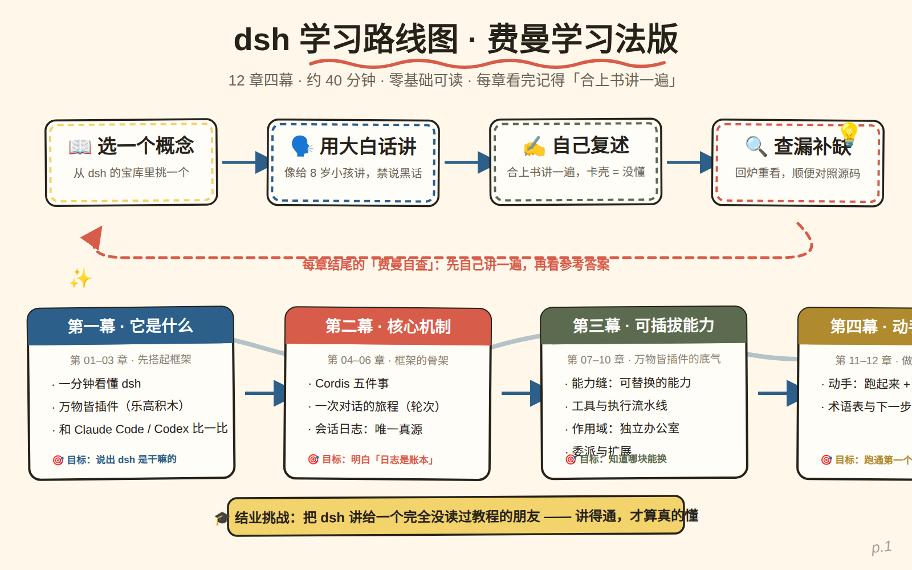

# 🎓 DeepSeek Harness for Humans

> Learn [DeepSeek Harness](https://github.com/deepseek-ai/deepseek-harness) (`dsh`) the **Feynman way** —
> a plain-language tutorial for DeepSeek AI's "**everything is a plugin**" AI agent framework.

**Original tutorial** · everyday analogies + a dash of humor · 14 original diagrams · Feynman-style self-quiz in every chapter · side-by-side comparison with Claude Code / Codex · **zero prerequisites**

<div align="center">
  
</div>

<div align="center">
  
</div>

> **📌 中文读者请阅读 [README.zh-CN.md](README.zh-CN.md)**（教程内容为中文，英文站点正在翻译中）

| | |
|---|---|
| 🌐 Read online | https://Hubert-hwk.github.io/dsh-for-humans/ |
| 📦 Offline download | [GitHub Releases](https://github.com/Hubert-hwk/dsh-for-humans/releases/latest) (zip — unzip and double-click `index.html`) |
| 📄 License | [MIT](LICENSE) © Hubert-hwk |

---

## What is this?

DeepSeek Harness (`dsh`) is an open-source AI agent framework from DeepSeek AI: it connects a large language
model to the real world — files, terminals, web pages, subagents — and handles "how to act once you've decided,
how to record everything you've done." Its headline claim: **everything is a plugin** — model adapters, tools,
session logs, even the agent loop itself are swappable building blocks.

"Everything is a plugin" is five words you can read and still not understand. That's exactly what this tutorial
is for. It explains dsh using the **Feynman technique** (pick a concept → explain it in plain words → recite it
back → fill the gaps): everyday analogies, original diagrams, and a quiz after every chapter. If you've never
heard of dsh, no problem — we use **Claude Code / Codex** as a yardstick and measure everything from there.

Written against the latest source and official docs of the dsh repository, verified up to **0.1.0-rc.5**.

## Table of contents (12 chapters · 4 acts)

| Act | Chapters | Contents |
|---|---|---|
| Act I · What it is | 01–03 | dsh in one minute · everything is a plugin · **vs Claude Code / Codex** |
| Act II · Core mechanics | 04–06 | Cordis in five ideas · the journey of one conversation (turns) · session log: single source of truth |
| Act III · Pluggable power | 07–10 | seams · tools & the execution pipeline · scopes · delegation & extension |
| Act IV · Hands-on & resources | 11–12 | run it + write a plugin · glossary & next steps |

Reading 01 → 11 in order takes about 40 minutes (laughter breaks allowed). For each chapter's Feynman quiz,
answer it out loud **before** expanding the reference answer — that's the whole point.

## Features

- ✅ **Zero prerequisites**: no framework background needed; Claude Code / Codex used as a comparison ruler
- 🧱 **Everything is a plugin**: from design philosophy to a source map, the swappable skeleton explained
- 🎨 **14 original SVG diagrams**: all local assets, no external CDN, nothing to load
- ❓ **Feynman self-quiz per chapter**: collapsible Q&A — answer first, then check
- 🚀 **100% static**: no build step, runs on any static host
- 📴 **Offline-friendly**: download the zip, double-click, read without internet

## Getting started (three ways)

### 1. Read online (recommended)

Open https://Hubert-hwk.github.io/dsh-for-humans/ — works on phones, tablets, and desktops.

### 2. Download the offline bundle

Grab the zip from the [Releases page](https://github.com/Hubert-hwk/dsh-for-humans/releases/latest),
unzip it, and double-click `index.html`. Zero external dependencies — it works offline.

### 3. Run locally / hack on it

```sh
git clone https://github.com/Hubert-hwk/dsh-for-humans.git
cd dsh-for-humans

# local preview (pick one)
python3 -m http.server 8080     # open http://127.0.0.1:8080
# or just double-click index.html (file:// protocol works too)
```

## Deploy to GitHub Pages

A GitHub Actions workflow (`.github/workflows/pages.yml`) is included: **pushing to `main` deploys automatically** — no manual build.

Enable it once, in one step:

1. After pushing, open repo **Settings → Pages**;
2. Set **Source** to `GitHub Actions` (do *not* pick "Deploy from a branch"), then Save;
3. Wait 1–2 minutes and visit `https://Hubert-hwk.github.io/dsh-for-humans/`.

> Manual alternative: Settings → Pages → Source `Deploy from a branch` → branch `main` → folder `/ (root)` → Save.

## Publish an offline release

Push a tag like `v1.0.0`; `.github/workflows/release.yml` builds the zip and creates a GitHub Release:

```sh
git tag v1.0.0
git push origin v1.0.0
```

Or build locally without CI:

```sh
bash scripts/build-release.sh v1.0.0
# artifact: dist/deepseek-harness-tutorial-v1.0.0.zip
```

## Repository structure

```
├── index.html                  # Homepage (navigation + Feynman method intro)
├── chapters/                   # 12 chapter pages
├── assets/
│   ├── css/style.css           # All styles (no external fonts / CDN)
│   ├── js/main.js              # Interactions: nav, copy, quiz fold, progress, syntax highlight
│   └── img/                    # 14 original SVG diagrams + favicon
├── docs/screenshot-home.png    # Screenshot for the README
├── scripts/build-release.sh    # One-command offline zip builder
├── .github/workflows/          # Pages auto-deploy + Release auto-package
├── README.md                   # This file (English)
├── README.zh-CN.md             # 中文版说明
└── LICENSE
```

## Customize & contribute

- Found something unclear, wrong, or missing? Open an [Issue](https://github.com/Hubert-hwk/dsh-for-humans/issues) or send a [PR](https://github.com/Hubert-hwk/dsh-for-humans/pulls);
- Edit content: `chapters/*.html` directly (semantic markup; DevTools will locate anything);
- Edit styles: theme variables in the `:root` block at the top of `assets/css/style.css` (`--brand` primary, `--accent` accent);
- Edit diagrams: `assets/img/*.svg` are vector files — open in any text editor, Figma, or Inkscape;
- The Feynman quizzes live in `<div class="quiz-item">`; `<div class="a">` is the reference answer (collapsed by default);
- Preview locally after changes, commit, push to `main` — it goes live automatically.

## Acknowledgments

- [DeepSeek Harness source](https://github.com/deepseek-ai/deepseek-harness) (MIT License)
- Official docs under `docs/` (Chinese & English) and `examples/` in the dsh repo
- Cordis: the plugin framework underneath dsh

## License

[MIT License](LICENSE) © Hubert-hwk
